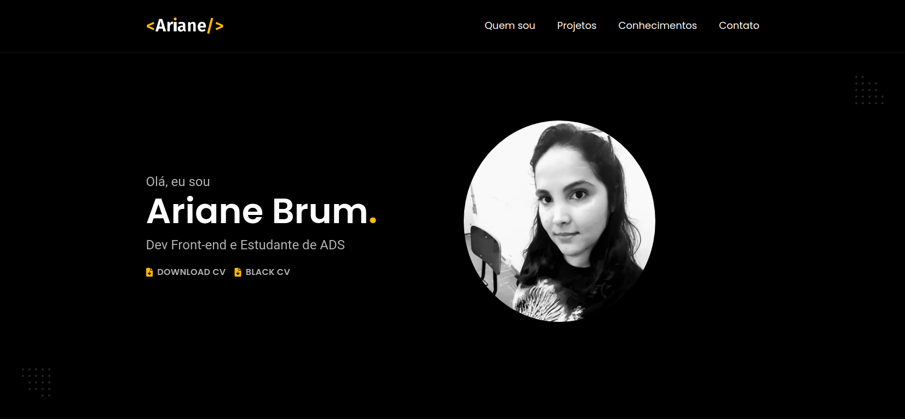

<h1 align="center">
  💻 Meu Portfólio
</h1>

<h4 align="center">
  Portfólio pessoal criado com o objetivo de apresentar um pouco sobre mim e meus conhecimentos. Além de mostrar meus projetos ao decorrer de minha carreira.
</h4>

<h4 align="center"><a href="">Clique para visitar o projeto</a></h4>

## 📚 Seções

O site é composto por 5 seções diferentes:

- **Intro:** Nele temos uma breve apresentação e o link para o meu currículo;
- **Quem sou:** Nessa seção tenho uma descrição dizendo um pouco sobre quem sou;
- **Projetos:** Exibe alguns projetos desenvolvidos, no qual, ao clicar no respectivo projeto, abre uma página com mais informações sobre o mesmo e seu link com o código no GitHub;
- **Conhecimentos:** Nele apresentamos meus conhecimentos em algumas linguagens como o foco no front-end, cursos que fiz e também minhas informações acadêmicas.
- **Contato:** Nessa sessão tenho as informações de contato;

---

## 💼 Tecnologias utilizadas

Para o desenvolvimento deste site utilizei as seguintes tecnologias:

- HTML;
- CSS;
- JavaScript;
- ScrollReveal;
- Fontawesome;

---

## 🦄 Autor 

<table>
  <tr>
    <td align="center">
      <a href="https://github.com/Ariane-Brum">
         
        
          <b>Ariane Brum</b>
        
      </a>
    </td>
  </tr>
</table>

Desenvolvido com :hearts: por Ariane Brum.
